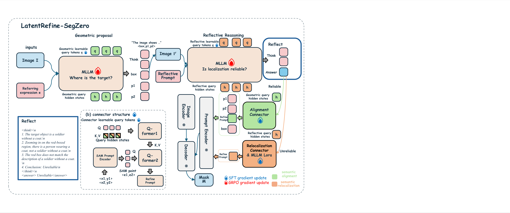

<div align="center">

<h1>LatentRefine-SegZero: Latent-Space Refinement for Referring Segmentation via Reflective Reasoning</h1>

<p>
  
  &nbsp;
  <a href=".">🐙 <strong>Code</strong></a>
  &nbsp;|&nbsp;
  📄 <strong>Paper</strong> (coming soon)
</p>
</div>

LatentRefine-SegZero is a reliability-aware latent-space refinement framework
for referring segmentation. It generates an initial box-and-point proposal,
reflects on whether the target localization is reliable, and dynamically
selects either semantic--geometric alignment or reflection-guided semantic
relocalization.

## Overview

Referring segmentation requires both accurate target grounding and precise
pixel-level mask prediction. Existing supervised fine-tuning methods achieve
strong in-domain segmentation performance but may weaken the general reasoning
and out-of-domain generalization capabilities of multimodal large language
models. Reinforcement learning better preserves these capabilities, but its
segmentation performance remains limited by the difficulty of generating
precise explicit coordinates.

LatentRefine-SegZero addresses this trade-off through reliability-aware
latent-space refinement:

- For a **reliable proposal**, the original geometric prompts are preserved,
  while an Alignment Connector maps MLLM representations into the SAM prompt
  space.
- For an **unreliable proposal**, a Relocalization Connector constructs a new
  latent prompt from reflection-enhanced representations without passing the
  original geometric prompt embedding to the final mask decoder.

The MLLM performs proposal generation, reflective reasoning, reliability
assessment, and pathway selection. Lightweight latent connectors perform
representation adaptation and mask refinement while the main MLLM and SAM
backbones remain frozen.

## Method

<p align="center">
  
</p>

Given an image and a referring expression, the MLLM first predicts an initial
geometric proposal consisting of:

```text
one bounding box + two positive points
```

The predicted bounding box is rendered on the original image to construct a
proposal-aware image. The MLLM then analyzes the initial target interpretation
and localization and predicts whether the proposal is reliable.

### Semantic--Geometric Alignment

When the initial localization is reliable, the bounding box and point prompts
provide trustworthy spatial constraints.

The Alignment Connector extracts target semantics from the MLLM hidden states
and maps them into SAM-compatible latent prompts. The latent semantic prompts
and original geometric prompts are jointly decoded by SAM to improve mask
boundaries and region completeness.

### Reflection-Guided Semantic Relocalization

When the initial localization is unreliable, retaining the original geometric
prompt may constrain SAM to an incorrect region.

The Relocalization Connector uses the proposal-aware image, referring
expression, and reflective context to reconstruct the target representation
and generate a new SAM-compatible latent prompt. The original geometric prompt
embedding is not passed to the final mask decoder.

### Two-Stage Latent Prompt Connector

Both refinement pathways use a two-stage latent prompt connector:

1. Learnable queries extract and compress target-relevant information from the
   MLLM hidden states.
2. Point-conditioned queries spatially ground the semantic tokens and map them
   into the SAM prompt space.

The point prompts act as internal spatial anchors. The Alignment and
Relocalization Connectors share the same architecture but use independent
parameters.

## Training Pipeline

The complete model training pipeline contains three stages:

```text
Joint Geometric Proposal and Reflective GRPO Training
        ↓
Alignment Branch SFT
        ↓
Relocalization Branch LoRA SFT
        ↓
Final Model
```

In the first stage, GRPO jointly optimizes:

- initial geometric proposal generation;
- reflective reasoning;
- proposal reliability assessment;
- reliability-aware pathway selection.

The following stages use pixel-level BCE and Dice losses to optimize the latent
refinement modules. SAM remains frozen, while gradients are propagated through
its differentiable mask decoder to the corresponding connector.

Before pathway-specific specialization, the Alignment and Relocalization
Connectors are jointly pre-aligned under the same segmentation supervision.

## Installation

```bash
conda create -n latentrefine python=3.10
conda activate latentrefine

# Example for CUDA 12.4.
# Select the PyTorch index matching your CUDA environment.
pip install torch==2.6.0 torchvision==0.21.0 torchaudio==2.6.0 \
  --index-url https://download.pytorch.org/whl/cu124

pip install -r requirements.txt --no-build-isolation
```

Run the following commands from the repository root.

## Data and Checkpoints

Prepare the following resources:

```text
/path/to/qwen2.5-vl-7b/
/path/to/sam2_hiera_large.pt
/path/to/coco/images/
/path/to/refcoco_train.json
/path/to/refcoco+_train.json
/path/to/refcocog_train.json
/path/to/refcocog_val.json
/path/to/refcocog_test.json
```

Released checkpoints and processed data will be linked here when available.

For the mapping between generated files and their producer scripts, see:

[`refine_segzero/Rl_data/README.md`](refine_segzero/Rl_data/README.md)

## Repository Structure

```text
LatentRefineSegZero/
├── README.md
├── README_CN.md
├── requirements.txt
├── model_merger.py
├── img/
│   ├── logo.png
│   ├── model.pdf
│   └── model.png
├── eval/                              # Evaluation scripts
└── refine_segzero/
    ├── configs/                       # Training configurations
    ├── Rl_data/                       # Proposal and GRPO data builders
    ├── geometric_query_*.py           # Model, training, and inference
    ├── query_reflect_grpo_reward.py   # GRPO reward functions
    └── run_*.sh                       # Distributed launchers
```

## Training

Set the model, dataset, checkpoint, and output paths in
`refine_segzero/configs/` and the corresponding launch scripts.

### Data Preparation

```bash
# Build initial proposal data
bash refine_segzero/Rl_data/run_build_stage1_data_4x80G.sh

# Build proposal-aware reflection samples
bash refine_segzero/Rl_data/run_build_reflect_samples_4x80G.sh

# Build the unified GRPO dataset
bash refine_segzero/Rl_data/run_build_unified_grpo_data_4x80G.sh
```

These scripts prepare the training data and are not additional model-training
stages.

### Stage 1: Joint Geometric Proposal and Reflective GRPO Training

```bash
bash refine_segzero/run_query_reflect_grpo_4x80G.sh
```

Convert the selected GRPO actor checkpoint:

```bash
python model_merger.py \
  --local_dir /absolute/path/to/global_step_xxx/actor
```

### Stage 2: Alignment Branch SFT

```bash
bash refine_segzero/run_geometric_query_branch_sft_4x80G.sh
```

### Stage 3: Relocalization Branch LoRA SFT

```bash
ALIGNED_EXPORT_DIR=/absolute/path/to/aligned_branch_export \
bash refine_segzero/run_geometric_query_direct_lora_sft_4x80G.sh
```

The GRPO checkpoint is an intermediate model. The export produced by the
Relocalization branch is used as the final model for evaluation.

## Evaluation

Run a one-sample RefCOCOg smoke test before full evaluation:

```bash
CUDA_VISIBLE_DEVICES=0 \
NPROC_PER_NODE=1 \
LIMIT=1 \
GEOMETRIC_EXPORT_DIR=/absolute/path/to/final_export \
REF_JSON_PATH=/absolute/path/to/refcocog_test.json \
IMAGE_ROOT=/absolute/path/to/coco/images \
OUTPUT_DIR=outputs/query_reflect_refcocog_smoke \
bash eval/run_generate_query_reflect_predictions_refcocog.sh
```

Set `LIMIT=-1` to evaluate the complete split.

The evaluation script reports:

- mask gIoU and cIoU;
- bounding-box IoU;
- Box Acc@0.5;
- pathway-selection statistics.

Adjust `CUDA_VISIBLE_DEVICES` and `NPROC_PER_NODE` according to your hardware.
Set `DRY_RUN=1` to inspect the assembled command without loading the models.

## Results

LatentRefine-SegZero is evaluated on RefCOCO, RefCOCO+, RefCOCOg, and RefAdv.

### In-Domain Referring Segmentation

The following results report cIoU (%).

| Dataset  | val   | testA | testB | test  |
|----------|------:|------:|------:|------:|
| RefCOCO  | 79.05 | 82.35 | 75.89 | --    |
| RefCOCO+ | 74.38 | 79.63 | 68.58 | --    |
| RefCOCOg | 75.66 | --    | --    | 76.20 |

### Out-of-Domain Generalization

| Dataset | BBox IoU | Box Acc@0.5 |
|---------|---------:|------------:|
| RefAdv  | 0.469    | 0.502       |

<!-- TODO: Add the full state-of-the-art comparison table. -->

<!-- TODO: Add qualitative segmentation and reflection examples. -->

<!-- TODO: Add ablation studies and efficiency results. -->

## Citation

```bibtex
@article{latentrefinesegzero2026,
  title   = {LatentRefine-SegZero: Latent-Space Refinement for Referring
             Segmentation via Reflective Reasoning},
  author  = {Anonymous},
  journal = {Under Review},
  year    = {2026}
}
```

## Acknowledgements

This project builds on:

- [Qwen2.5-VL](https://github.com/QwenLM/Qwen2.5-VL)
- [SAM 2](https://github.com/facebookresearch/sam2)
- [veRL](https://github.com/volcengine/verl)

We thank the authors and open-source communities behind these projects.

## License

The repository license will be added before public release. External models
and datasets remain subject to their respective licenses.